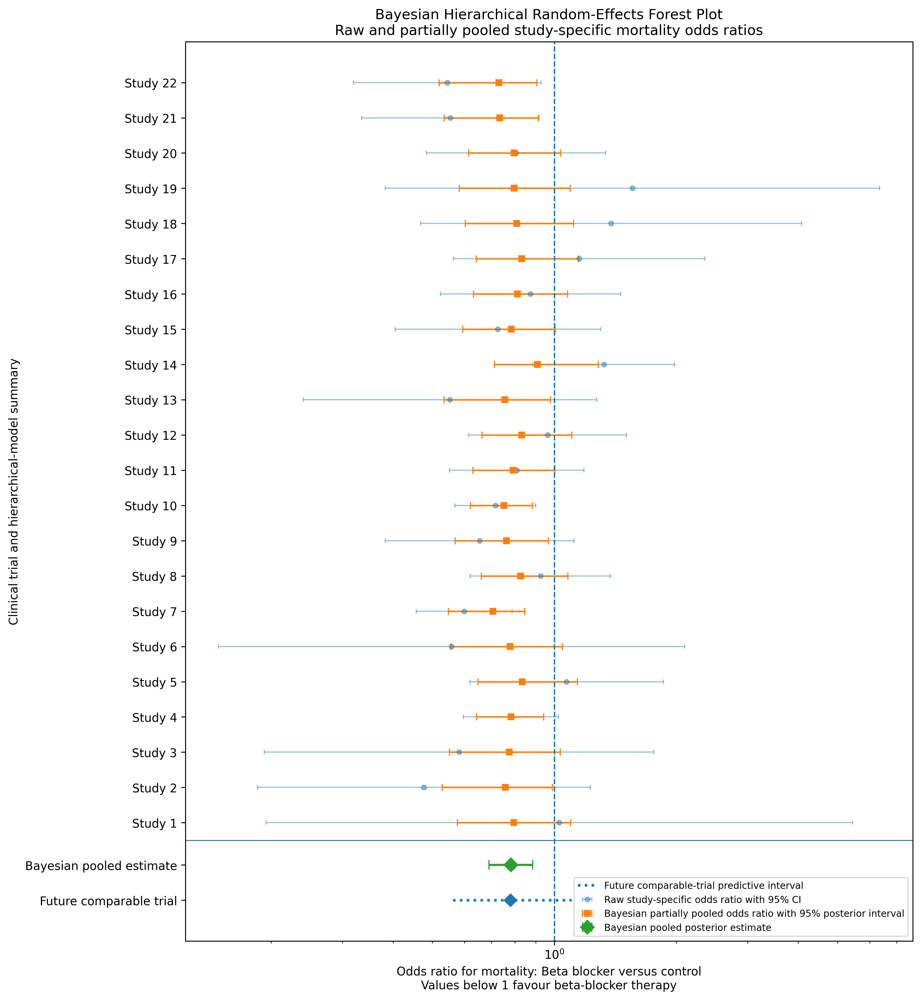
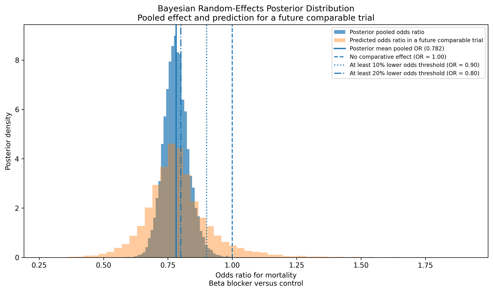
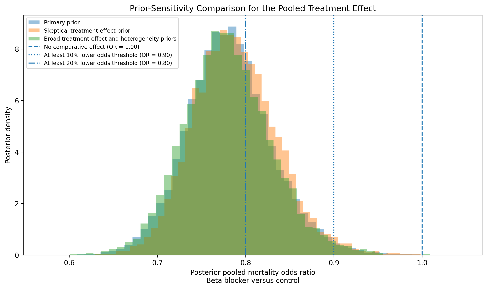
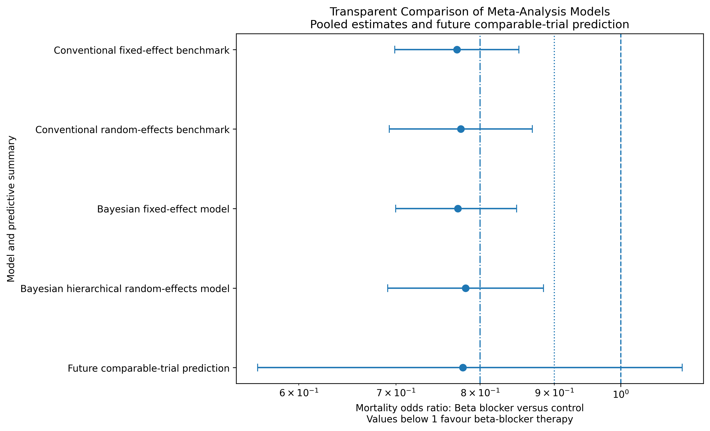

# Bayesian Evidence Synthesis for Comparative Treatment Effectiveness Using Python

## Beta-Blocker Therapy and Mortality After Myocardial Infarction

This repository presents a reproducible Bayesian evidence-synthesis workflow using mortality outcomes from 22 randomized clinical trials comparing beta-blocker therapy with control after myocardial infarction.

The project is designed as a PhD-level statistical-consulting portfolio example focused on clinical evidence synthesis, biostatistics, comparative treatment effectiveness, uncertainty assessment, and reproducible statistical computing.

## Clinical Question

What does the available comparative evidence suggest about mortality outcomes with beta-blocker therapy, how much between-study heterogeneity remains, and how sensitive are the conclusions to reasonable prior assumptions?

The objective is not simply to calculate one pooled estimate. The workflow evaluates whether the comparative-effect conclusion remains defensible after examining study-level variation, model structure, heterogeneity, posterior uncertainty, prior-predictive checks, posterior-predictive checks, convergence diagnostics, and prior sensitivity.

## Dataset

The project uses the publicly available `blocker` dataset from the `multinma` R package.

The original dataset contains 44 arm-level records from 22 randomized clinical trials.

| Group | Participants | Deaths | Descriptive mortality |
|---|---:|---:|---:|
| Control | 9,849 | 985 | 10.00% |
| Beta blocker | 10,441 | 826 | 7.91% |

Original public source:

`https://raw.githubusercontent.com/cran/multinma/master/data/blocker.rda`

## Analytical Workflow

The analysis includes:

1. public-data acquisition and documentation;
2. raw-data integrity checks;
3. effect-size verification;
4. descriptive study-level visualization;
5. a conventional fixed-effect benchmark;
6. a conventional random-effects benchmark using the Paule–Mandel heterogeneity estimator and a modified Hartung–Knapp confidence interval;
7. a Bayesian fixed-effect model;
8. a Bayesian hierarchical random-effects model;
9. prior-predictive checks;
10. posterior-predictive checks;
11. convergence diagnostics;
12. trial-specific partial pooling;
13. predicted treatment-effect uncertainty for a future comparable trial;
14. prior-sensitivity analysis;
15. prior-versus-posterior comparisons;
16. and transparent model-comparison reasoning.

## Effect-Size Convention

Odds ratios compare beta-blocker therapy with control.

- An odds ratio below 1 indicates lower mortality odds with beta-blocker therapy.
- An odds ratio above 1 indicates higher mortality odds with beta-blocker therapy.

No trial contained a zero cell. Continuity corrections were therefore not required.

## Conventional Benchmark Results

| Model | Pooled odds ratio | 95% interval |
|---|---:|---:|
| Fixed-effect inverse-variance benchmark | 0.7711 | 0.6987 to 0.8510 |
| Random-effects benchmark | 0.7760 | 0.6927 to 0.8693 |

The conventional random-effects benchmark produced:

- Paule–Mandel `tau = 0.0723`;
- `I² = 9.73%`;
- and an approximate prediction interval of `0.6427 to 0.9369`.

## Bayesian Fixed-Effect Results

The Bayesian fixed-effect reference model estimated:

| Quantity | Estimate |
|---|---:|
| Posterior mean pooled odds ratio | 0.7725 |
| 95% posterior HDI | 0.6998 to 0.8477 |
| Probability that OR < 1 | 100.00% |
| Probability that OR < 0.90 | 99.89% |
| Divergences | 0 |

## Primary Bayesian Hierarchical Random-Effects Results

The hierarchical random-effects model is retained as the primary interpretation model because it allows trial-specific treatment effects to vary around an overall pooled effect.

| Quantity | Estimate |
|---|---:|
| Posterior mean pooled odds ratio | 0.7820 |
| 95% posterior HDI | 0.6910 to 0.8847 |
| Posterior mean heterogeneity `tau` | 0.1255 |
| 95% posterior HDI for `tau` | approximately 0.0000 to 0.2644 |
| Probability that pooled OR < 1 | 99.99% |
| Probability that pooled OR < 0.90 | 98.64% |
| Probability that pooled OR < 0.80 | 66.67% |
| Probability that a future comparable trial has OR < 1 | 94.26% |

The predicted odds ratio for a future comparable trial had a median of `0.7786` and a 95% posterior predictive interval of:

`0.5621 to 1.1024`

This interval crosses 1. The pooled evidence suggests benefit across the included historical trials, but the result should not be interpreted as a guarantee that every future comparable trial will produce a favorable estimate.

## Primary Prior Structure

The primary hierarchical model uses:

```text
alpha_study ~ Normal(logit(0.10), 0.75)
mu          ~ Normal(0, 0.5)
tau         ~ HalfNormal(0.5)
delta_study = mu + tau * z_study
z_study     ~ Normal(0, 1)
```

The treatment-effect prior is centered on no comparative effect. The scale-aware baseline-risk prior was selected after an explicit prior-predictive refinement step.

## Prior-Sensitivity Analysis

The hierarchical model was refitted using three scenarios:

| Scenario | Posterior mean pooled OR | 95% interval | Posterior mean `tau` | Future-trial interval |
|---|---:|---:|---:|---:|
| Primary weakly informative prior | 0.7820 | 0.6903 to 0.8844 | 0.1255 | 0.5621 to 1.1024 |
| Skeptical treatment-effect prior | 0.7885 | 0.7018 to 0.8908 | 0.1235 | 0.5708 to 1.1131 |
| Broader treatment-effect and heterogeneity priors | 0.7793 | 0.6869 to 0.8841 | 0.1272 | 0.5541 to 1.1041 |

The pooled comparative-effect interpretation remained broadly stable across reasonable alternative priors.

## Diagnostics

The primary hierarchical model produced:

| Diagnostic | Result |
|---|---:|
| Chains | 4 |
| Posterior draws | 12,000 |
| Divergences | 0 |
| Maximum R-hat | 1.0020 |
| Minimum bulk ESS | 2,646.76 |
| Minimum tail ESS | 4,027.65 |

Posterior-predictive checks reproduced the observed aggregate mortality patterns closely. The observed study-level death counts were covered by the corresponding predictive intervals across all trial arms.

## Selected Figures

### Bayesian Partial-Pooling Forest Plot



### Pooled Effect and Future Comparable-Trial Prediction



### Prior-Sensitivity Analysis



### Transparent Model Comparison



## Repository Structure

```text
bayesian-evidence-synthesis-treatment-effectiveness-python/
├── README.md
├── requirements.txt
├── .gitignore
├── runtime_environment.txt
├── data/
│   ├── README.md
│   ├── blocker_multinma_original.rda
│   ├── blocker_raw.csv
│   ├── blocker_clean_arm_level.csv
│   └── blocker_study_level_evidence.csv
├── notebooks/
│   ├── Bayesian_Evidence_Synthesis_Treatment_Effectiveness.ipynb
│   └── README.md
├── scripts/
│   └── README.md
└── outputs/
    ├── README.md
    ├── figures/
    ├── tables/
    ├── diagnostics/
    ├── project_summary.csv
    ├── project_summary.json
    ├── repository_output_audit.csv
    └── final_outputs_folder_inventory.csv
```

## Reproducibility

The workflow was developed in Google Colab and saved in a persistent Google Drive workspace.

To reproduce the analysis:

1. open the notebook in Google Colab;
2. mount Google Drive when prompted;
3. run the notebook cells in order;
4. review the generated figures, tables, and diagnostic objects in the `outputs/` folder.

Package versions are recorded in:

- `requirements.txt`;
- and `runtime_environment.txt`.

## Interpretation Boundary

This repository presents a reproducible evidence-synthesis analysis using a historical public clinical-trial dataset.

It is not a current clinical-practice recommendation.

The pooled estimate should not be interpreted as universally applicable to every population, setting, or future comparable trial.

## Technical Stack

- Python
- PyMC
- ArviZ
- NumPy
- pandas
- SciPy
- matplotlib
- pyreadr

## Author

**Dr. Imran Sarmad**  
PhD Statistical Consultant | Advanced Quantitative Modeling (R, Mplus, Python)  
Lecturer, Virtual University of Pakistan  

Website: `https://drimransarmad.com`  
LinkedIn: `https://www.linkedin.com/in/dr-imran-sarmad/`


## Public Repository Packaging Note

The full local workflow generates ArviZ NetCDF posterior and
posterior-predictive objects for reproducibility and technical review.

These binary diagnostic objects are intentionally excluded from the
public GitHub repository to keep it lightweight and practical to clone.
They can be regenerated by running the Colab notebook sequentially.

The public repository retains the complete notebook, figures, CSV
summaries, convergence diagnostics, posterior-predictive audit tables,
and prior-sensitivity results.
